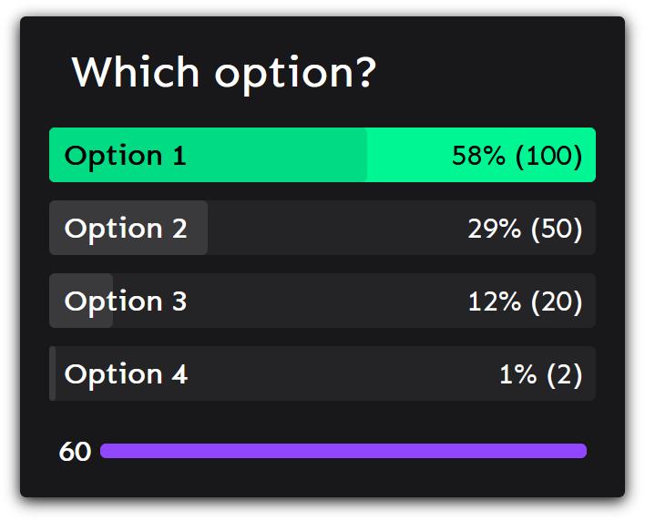
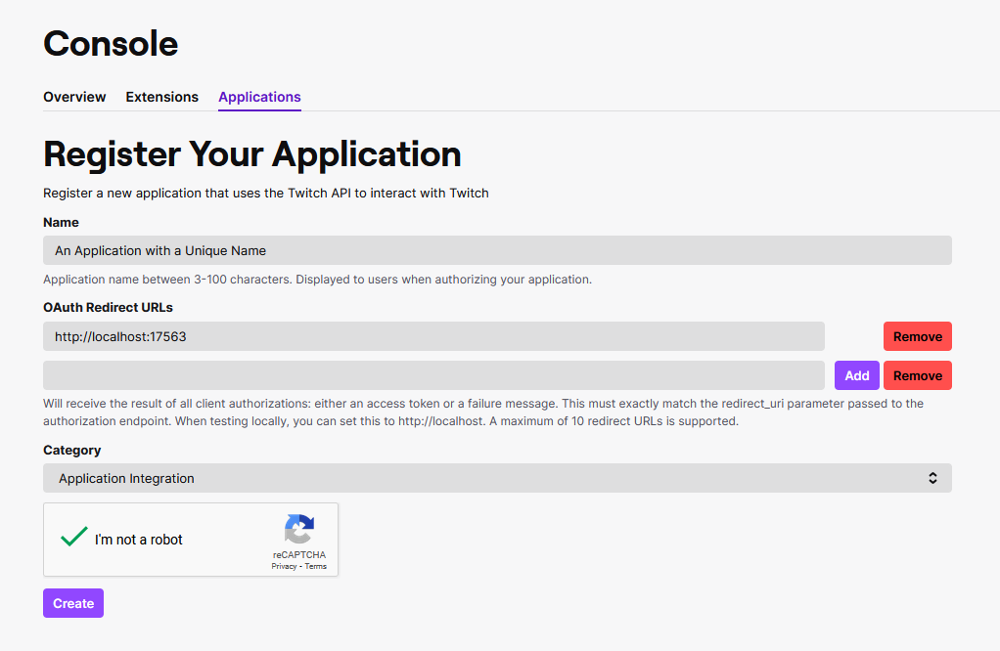
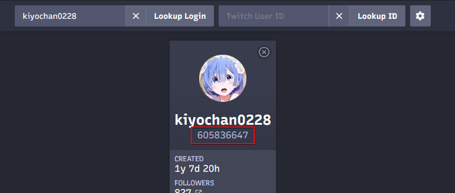
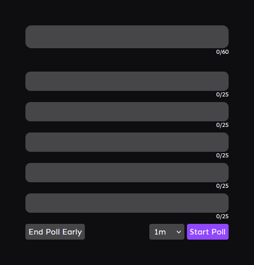

# Twitch Poll Viewer

View twitch polls on OBS

---

**WARNING: This application relies on polling Twitch, and is thus unsuitable for running for long periods of time.**

You should be fine running it for a stream segment that uses a poll or two, or an entire stream dedicated to running polls, but it should not be kept running 24/7, or for every single stream.

**Requirements:**

1. Twitch Affiliate (to run polls)
2. Twitch 2FA Enabled

# Setup Guide

Note: If you are running another application like the [twitch hue interface](https://github.com/Roadcrosser/channelpoint-hue), some steps may be different. An advanced guide for these cases will be written eventually.

1. Download the latest version from the [Releases page](https://github.com/Roadcrosser/twitch-poll-viewer/releases) and unzip it somewhere.
2. Open `config.yaml` in a text editor like Notepad (or [Notepad++](https://notepad-plus-plus.org/)). If the file is not present, run the `.exe` file once to generate it.
3. Create a Twitch Application [here](https://dev.twitch.tv/console/apps/create).
    - Your application name has to be unique (much like usernames), so a name like `YOUR_USERNAME_HERE Polls` should be fine
    - Add `http://localhost:17563` under **Oauth Redirect URLs**. Remember to click **Add**
    - Select `Application Integration` as your **Category** (not that it matters).
    - It should look something like the image below. Click **Create** when you are done, and then **Manage** on your application.
        - 
4. On your **Manage Application** page, click the **New Secret** button at the bottom and click **OK** on the prompt.
5. Copy your **Client ID** and **Client Secret** values that are displayed on the **Manage Application** page and copy them to `CLIENT_ID` and `CLIENT_SECRET` in your `config.yaml`.
6. Get your Twitch ID [here](https://codepen.io/Alca/full/RwaredM).
    - Enter your Twitch username in the `Twitch Login` box, and click **Lookup Login**
    - Your Twitch ID is the 10-digit number that shows underneath your name in the window that pops up, as in the following image (highlighted with the red square).
        - 
7. Copy your Twitch ID to `USER_ID` in your `config.yaml`
8. Save `config.yaml`.
9. Run the `.exe`. Go through the Twitch prompts that open on your browser.
10. On OBS, add a Browser source with the URL `http://localhost:5000`. Remove everything in the **Custom CSS** box, and ensure that **Shutdown source when not visible** and **Refresh browser when scene becomes active** are both unchecked.
11. You are done!

# Poll Creator

This application also comes with a Poll Creator, which can be accessed at `http://localhost:5000/create` in your browser while the application is running.

You do not have to use this, but it is a handy tool if you want to create and end polls rapidly, saving you the need to type the same thing repeatedly.

# Troubleshooting

**I ran it for the first time, and it worked, but when I closed it and reopened it a few hours later, I get an Authentication Error!**

If you encounter this issue, delete `twitch_secrets.json` from the files.

You will also want to set `NEVER_CACHE_TWITCH` to `true` in `config.yaml` if you are having this issue recurringly. As a side effect, you will have to manually authenticate each time you run.

I have no idea if this is actually still an issue, so if you experience this, please tell me. 